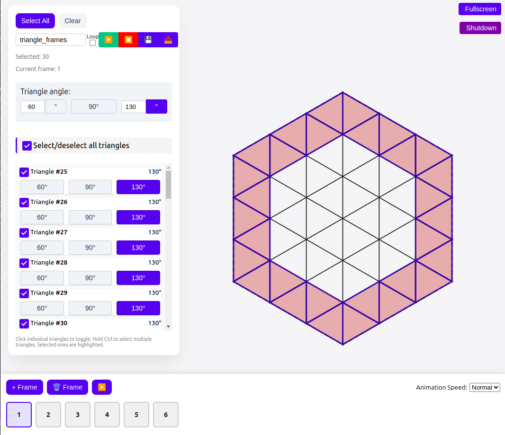
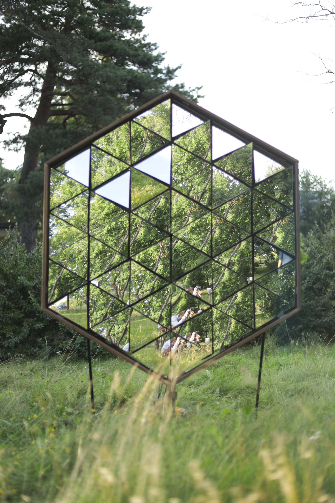
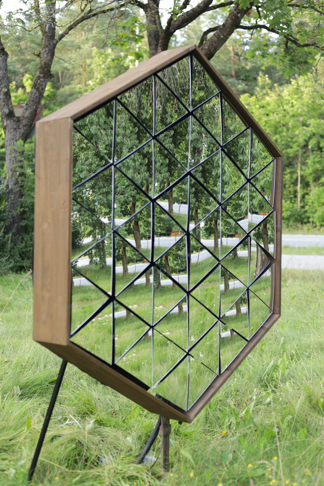

# Mirror Universes: Reflections of Ourselves in Time and Space

This installation consists of **54 triangular mirrors** — each 25 cm in size, each its own universe. These mirrors are not merely physical surfaces but **symbolic portals** that reflect the many facets of our being. Every person we encounter, every moment we live through — they are all reflections of ourselves. Some reveal our **past**, others place us firmly in the **present**, while still others hint at possible **futures**.

The **triangle** as a shape symbolizes **movement and balance** — between **body**, **mind**, and **soul**. Reflections break and bend at different angles, reminding us that our identity is never singular or fixed, but **multifaceted** and constantly evolving. The 54 mirrors represent **54 windows into the inner cosmos**, through which each viewer sees something different — depending on their **perspective** and what they are **seeking**.

This is a **journey toward the self through others** — through reflections that may be **sharp**, **distorted**, or **beautifully honest**. Because it is in those reflections that we begin to truly understand **who we are**.


## Setup on Raspberry Pi

1. Install dependencies:
```bash
pip install adafruit-circuitpython-servokit
```

2. Connect servos:
- Adafruit 16-Channel PWM / Servo HAT for Raspberry Pi
- Define each hat to have unique address, recommended to start from 0x40 to 0x43

## Running

### Command Line Interface

1. Start the program directly:
```bash
python main.py
```

2. Available commands:
- `play` - Run wave animation on all mirrors
- `playone` - Test wave on single mirror
- `servo <number>` - Find channel for servo number
- `channel <number>` - Find servo for channel number
- `<table_number> <angle>` - Move specific mirror (e.g., `1 135`)
- `list` - Show all mirrors
- `quit` - Exit

### Animation Tool Interface

1. Start the web-based animation tool:
```bash
cd animation-tool
python server.py
```

2. Access the interface:
- Open a web browser and navigate to `http://localhost` or `http://[raspberry-pi-ip]`
- For Raspberry Pi, the interface automatically starts in fullscreen mode

3. Interface features:
- Visual triangle selection for creating animations
- Multiple frames with adjustable angles
- Animation playback with speed control
- Import/export animations as JSON
- Direct control of the physical mirrors through main.py

4. Creating animations:
- Select triangles by clicking or using multi-select with Ctrl/Cmd key
- Set angles using the angle controls (default: 60°, 90°, 130°)
- Add frames to create animation sequences
- Preview animations in the interface
- Click "Play on SunMirror" to send to physical installation

## Configuration
- 54 total mirrors in 3 rings:
  - Inner: 6 mirrors
  - Middle: 18 mirrors
  - Outer: 30 mirrors
- Default speed: 11ms per degree
- Wave amplitude: 45 degrees
- Center position: 90 degrees

## Results

### Images


*Animation tool interface*


*Full view of the mirror installation with all 54 triangular mirrors*


*Close-up of individual triangular mirrors showing reflection detail*

### Video

[](https://drive.google.com/file/d/19RAJ3am_T07Rodu_74JJLM20cEBN8nMh/view?fbclid=IwY2xjawMJFElleHRuA2FlbQIxMABicmlkETFTT3R6NHNMNW1KazlPQWNZAR4zTPX6x1mj9gyFzKH4-K2Woc0Dq1B5IQ8ib722YHcj0DwXNxMhHPrqF8Q9xg_aem_qBE1fpnqFMe8xJx90wKDSw)
*Click to watch the full demonstration video*
